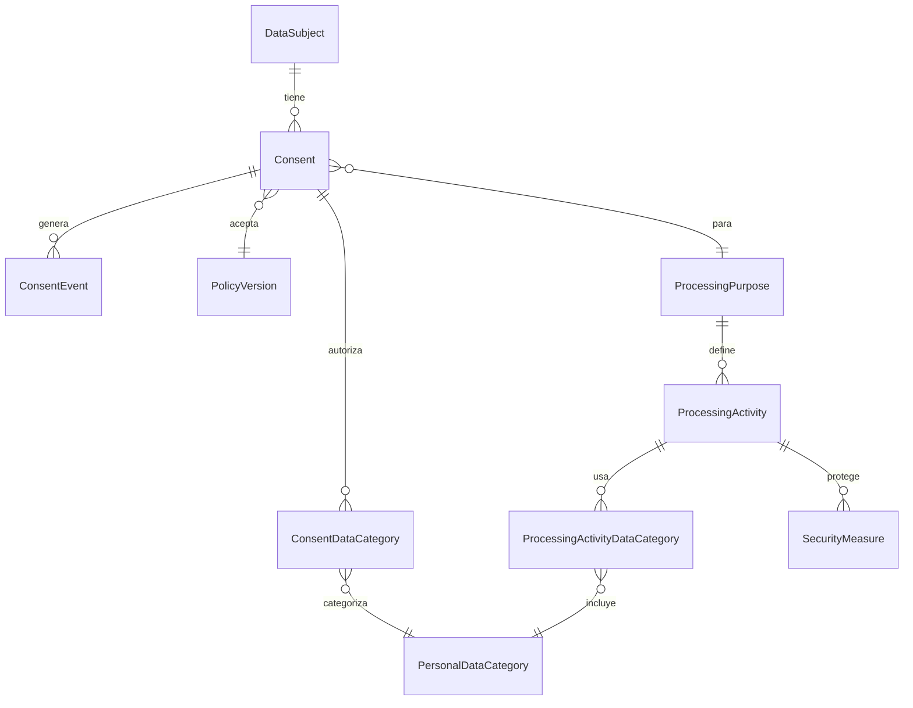

### Atributos de las entidades principales

#### Consent
| Campo              | Tipo de dato         | Descripción                                      |
|--------------------|---------------------|--------------------------------------------------|
| id                 | UUID                | Identificador único                              |
| organizationId     | UUID                | Organización                                     |
| dataSubjectId      | UUID                | Sujeto de datos                                  |
| purposeId          | UUID                | Propósito de procesamiento                       |
| policyVersionId    | UUID                | Versión de política                              |
| status             | ConsentStatus (enum)| Estado del consentimiento                        |
| grantedAt          | LocalDateTime       | Fecha de otorgamiento                            |
| revokedAt          | LocalDateTime       | Fecha de revocación                              |
| expiresAt          | LocalDateTime       | Fecha de expiración                              |
| collectionMethod   | CollectionMethod    | Método de recolección                            |
| evidenceHash       | String              | Hash de evidencia                                |
| evidenceUrl        | String              | URL de evidencia                                 |
| notes              | String              | Notas adicionales                                |
| createdAt          | LocalDateTime       | Fecha de creación                                |
| updatedAt          | LocalDateTime       | Fecha de actualización                           |

#### ConsentEvent
| Campo              | Tipo de dato         | Descripción                                      |
|--------------------|---------------------|--------------------------------------------------|
| id                 | UUID                | Identificador único                              |
| consentId          | UUID                | Consentimiento asociado                          |
| eventType          | ConsentEventType    | Tipo de evento                                   |
| previousStatus     | ConsentStatus       | Estado previo                                    |
| newStatus          | ConsentStatus       | Nuevo estado                                     |
| eventTimestamp     | LocalDateTime       | Fecha/hora del evento                            |
| performedByUserId  | UUID                | Usuario que realizó la acción                    |
| channel            | String              | Canal (web, móvil, etc.)                         |
| ipAddress          | String              | IP de origen                                     |
| userAgent          | String              | User agent                                       |
| textSnapshot       | String              | Texto de snapshot                                |
| evidenceHash       | String              | Hash de evidencia                                |
| evidenceUrl        | String              | URL de evidencia                                 |
| detailsJson        | String              | Detalles adicionales en JSON                     |

#### ConsentDataCategory
| Campo                  | Tipo de dato | Descripción                                      |
|------------------------|--------------|--------------------------------------------------|
| id                     | UUID         | Identificador único                              |
| consentId              | UUID         | Consentimiento asociado                          |
| personalDataCategoryId | UUID         | Categoría de dato personal asociada              |

#### DataSubject
| Campo           | Tipo de dato     | Descripción                                      |
|-----------------|------------------|--------------------------------------------------|
| id              | UUID             | Identificador único                              |
| organizationId  | UUID             | Organización                                     |
| firstName       | String           | Nombre                                           |
| lastName        | String           | Apellido                                         |
| documentType    | String           | Tipo de documento                                |
| documentNumber  | String           | Número de documento                              |
| email           | String           | Correo electrónico                               |
| phone           | String           | Teléfono                                         |
| address         | String           | Dirección                                        |
| status          | DataSubjectStatus| Estado del sujeto de datos                       |
| createdAt       | LocalDateTime    | Fecha de creación                                |
| updatedAt       | LocalDateTime    | Fecha de actualización                           |

#### PersonalDataCategory
| Campo           | Tipo de dato     | Descripción                                      |
|-----------------|------------------|--------------------------------------------------|
| id              | UUID             | Identificador único                              |
| organizationId  | UUID             | Organización                                     |
| name            | String           | Nombre de la categoría                           |
| description     | String           | Descripción                                      |
| sensitive       | boolean          | Indica si es dato sensible                       |
| active          | boolean          | Activa/inactiva                                  |
| createdAt       | LocalDateTime    | Fecha de creación                                |
| updatedAt       | LocalDateTime    | Fecha de actualización                           |

#### PolicyVersion
| Campo           | Tipo de dato     | Descripción                                      |
|-----------------|------------------|--------------------------------------------------|
| id              | UUID             | Identificador único                              |
| organizationId  | UUID             | Organización                                     |
| code            | String           | Código de la política                            |
| title           | String           | Título                                           |
| contentSnapshot | String           | Contenido de la política                         |
| versionLabel    | String           | Etiqueta de versión                              |
| effectiveFrom   | LocalDateTime    | Vigencia                                         |
| active          | boolean          | Activa/inactiva                                  |
| createdAt       | LocalDateTime    | Fecha de creación                                |
| updatedAt       | LocalDateTime    | Fecha de actualización                           |

#### ProcessingPurpose
| Campo           | Tipo de dato     | Descripción                                      |
|-----------------|------------------|--------------------------------------------------|
| id              | UUID             | Identificador único                              |
| organizationId  | UUID             | Organización                                     |
| code            | String           | Código del propósito                             |
| name            | String           | Nombre                                           |
| description     | String           | Descripción                                      |
| legalBasis      | LegalBasis       | Base legal                                       |
| required        | boolean          | Es requerido                                     |
| active          | boolean          | Activo/inactivo                                  |
| createdAt       | LocalDateTime    | Fecha de creación                                |
| updatedAt       | LocalDateTime    | Fecha de actualización                           |

#### ProcessingActivity
| Campo                | Tipo de dato                 | Descripción                                      |
|----------------------|------------------------------|--------------------------------------------------|
| id                   | UUID                         | Identificador único                              |
| organizationId       | UUID                         | Organización                                     |
| name                 | String                       | Nombre de la actividad                           |
| description          | String                       | Descripción                                      |
| purposeId            | UUID                         | Propósito asociado                               |
| responsiblePersonId  | UUID                         | Responsable                                      |
| storageLocation      | String                       | Ubicación de almacenamiento                      |
| retentionPeriodDays  | Integer                      | Días de retención                                |
| internationalTransfer| boolean                      | Transferencia internacional                      |
| thirdPartySharing    | boolean                      | Compartido con terceros                          |
| riskLevel            | ProcessingActivityRiskLevel  | Nivel de riesgo                                  |
| status               | ProcessingActivityStatus      | Estado                                           |
| createdAt            | LocalDateTime                | Fecha de creación                                |
| updatedAt            | LocalDateTime                | Fecha de actualización                           |

#### ProcessingActivityDataCategory
| Campo                  | Tipo de dato | Descripción                                      |
|------------------------|--------------|--------------------------------------------------|
| id                     | UUID         | Identificador único                              |
| processingActivityId   | UUID         | Actividad de procesamiento asociada               |
| personalDataCategoryId | UUID         | Categoría de dato personal asociada              |
| createdAt              | LocalDateTime| Fecha de creación                                |

#### SecurityMeasure
| Campo                | Tipo de dato         | Descripción                                      |
|----------------------|---------------------|--------------------------------------------------|
| id                   | UUID                | Identificador único                              |
| processingActivityId | UUID                | Actividad de procesamiento asociada              |
| name                 | String              | Nombre de la medida                              |
| description          | String              | Descripción                                      |
| measureType          | SecurityMeasureType | Tipo de medida                                   |
| implemented          | boolean             | Si está implementada                             |
| createdAt            | LocalDateTime       | Fecha de creación                                |
| updatedAt            | LocalDateTime       | Fecha de actualización                           |

---

## Resumen de la API

La API RESTful de complianceService permite gestionar el ciclo de vida de consentimientos, sujetos de datos, categorías de datos personales, propósitos, actividades de procesamiento, versiones de políticas y medidas de seguridad. Cada recurso cuenta con endpoints CRUD y filtros avanzados. Todas las operaciones quedan auditadas mediante eventos y se garantiza la trazabilidad y cumplimiento normativo.
## Modelo de Datos Principal

El modelo de datos está compuesto por las siguientes entidades principales:

| Entidad                        | Descripción                                                                                 | Relaciones clave                                        |
|--------------------------------|---------------------------------------------------------------------------------------------|---------------------------------------------------------|
| Consent                        | Consentimiento otorgado por un sujeto de datos para un propósito y versión de política      | DataSubject, ProcessingPurpose, PolicyVersion, ConsentEvent, ConsentDataCategory |
| ConsentEvent                   | Evento de auditoría sobre un consentimiento (creación, actualización, revocación, etc.)     | Consent                                                 |
| ConsentDataCategory            | Relación entre un consentimiento y las categorías de datos personales autorizadas           | Consent, PersonalDataCategory                           |
| DataSubject                    | Sujeto de datos (usuario)                                                                   | Consent                                                 |
| PersonalDataCategory           | Categoría de dato personal (ej: email, dirección, etc.)                                    | ConsentDataCategory, ProcessingActivityDataCategory      |
| PolicyVersion                  | Versión de una política de privacidad                                                       | Consent                                                 |
| ProcessingPurpose              | Propósito de procesamiento de datos y su base legal                                         | Consent, ProcessingActivity                             |
| ProcessingActivity             | Actividad de tratamiento de datos personales                                                | ProcessingPurpose, ProcessingActivityDataCategory, SecurityMeasure |
| ProcessingActivityDataCategory | Relación entre actividad de procesamiento y categoría de dato personal                      | ProcessingActivity, PersonalDataCategory                 |
| SecurityMeasure                | Medida de seguridad implementada para una actividad de procesamiento                        | ProcessingActivity                                      |

### Diagrama simplificado de relaciones

Cada entidad incluye campos de auditoría (`createdAt`, `updatedAt`), identificadores UUID y relaciones mediante claves foráneas.
## Repositorios de PrivData

## authService: [Link al repo](https://github.com/WVinet/authservice-PrivData.git)
## frontend-PrivDataReact: [Link al repo](https://github.com/miloQ1/frontend-Privdata.git)

---

# complianceService - PrivData

Este repositorio contiene el microservicio **complianceService** del ecosistema PrivData. Está desarrollado en **Spring Boot** con **Java 17** y tiene como objetivo principal gestionar el cumplimiento normativo (compliance) relacionado con la privacidad de los datos.

## Tecnologías Principales
- **Java 17**
- **Spring Boot** (WebMVC, Data JPA, Validation)
- **PostgreSQL** (Persistencia de datos)
- **Springdoc OpenAPI / Swagger** (Documentación interactiva de la API)

## Modelos y Dominios Principales
El servicio maneja la lógica de negocio y persistencia de las siguientes entidades:

- **DataSubject**: Gestión de los sujetos de datos (usuarios a los que pertenecen los datos).
- **ProcessingPurpose**: Definición de los propósitos para los cuales se procesa la información y sus bases legales.
- **PolicyVersion**: Control de las diferentes versiones de las políticas de privacidad.
- **Consent & ConsentDataCategory**: Administración de los consentimientos otorgados, actualizados o revocados por los sujetos de datos.
- **ConsentEvent**: Registro de auditoría y trazabilidad inmutable sobre cualquier acción en los consentimientos.

## Estructura del Proyecto
La aplicación sigue una arquitectura clásica de múltiples capas:
- `controller/`: Controladores REST para exponer la API (`ConsentController`, `DataSubjectController`, etc.).
- `service/`: Lógica de negocio y orquestación de operaciones.
- `repository/`: Interfaces de Spring Data JPA para la comunicación con PostgreSQL.
- `model/` y `enums/`: Entidades JPA que mapean el dominio y enumeraciones para estados y tipos (`ConsentStatus`, `LegalBasis`, etc.).
- `DTO/`: Objetos de transferencia de datos separados en `request` (con validaciones) y `response`.

---

## Documentación de la API

### Endpoints principales

| Recurso                        | Endpoint base                                      | Funcionalidad principal                       |
|--------------------------------|----------------------------------------------------|-----------------------------------------------|
| Consentimientos                | `/api/compliance/consents`                         | Gestión de consentimientos y eventos          |
| Sujetos de datos               | `/api/compliance/data-subjects`                    | Gestión de usuarios/sujetos de datos          |
| Categorías de datos personales | `/api/compliance/personal-data-categories`         | Gestión de categorías de datos personales     |
| Versiones de política          | `/api/compliance/policy-versions`                  | Control de versiones de políticas             |
| Propósitos de procesamiento    | `/api/compliance/processing-purposes`              | Gestión de propósitos y bases legales         |
| Actividades de procesamiento   | `/api/compliance/processing-activities`            | Gestión de actividades de tratamiento         |
| Relación actividad-categoría   | `/api/compliance/processing-activity-data-categories` | Relaciona actividades con categorías de datos |
| Medidas de seguridad           | `/api/compliance/security-measures`                | Gestión de medidas de seguridad               |

Cada endpoint soporta operaciones CRUD (GET, POST, PUT/PATCH, DELETE según corresponda) y filtros por parámetros (por ejemplo, organización, estado, búsqueda, etc.).

### Principales DTOs de Request/Response

**Request DTOs:**
- ConsentCreateRequestDTO, ConsentActionRequestDTO, ConsentCategoriesUpdateRequestDTO
- DataSubjectCreateRequestDTO, DataSubjectUpdateRequestDTO, DataSubjectStatusUpdateRequestDTO
- PersonalDataCategoryCreateRequestDTO, PersonalDataCategoryUpdateRequestDTO, PersonalDataCategoryStatusUpdateRequestDTO
- PolicyVersionCreateRequestDTO, PolicyVersionUpdateRequestDTO, PolicyVersionStatusUpdateRequestDTO
- ProcessingPurposeCreateRequestDTO, ProcessingPurposeUpdateRequestDTO, ProcessingPurposeStatusUpdateRequestDTO
- ProcessingActivityCreateRequestDTO, ProcessingActivityUpdateRequestDTO, ProcessingActivityStatusUpdateRequestDTO
- ProcessingActivityDataCategoryCreateRequestDTO, ProcessingActivityDataCategoryReplaceRequestDTO
- SecurityMeasureCreateRequestDTO, SecurityMeasureUpdateRequestDTO, SecurityMeasureImplementedUpdateRequestDTO

**Response DTOs:**
- ConsentResponseDTO, ConsentEventResponseDTO
- DataSubjectResponseDTO
- PersonalDataCategoryResponseDTO
- PolicyVersionResponseDTO
- ProcessingPurposeResponseDTO
- ProcessingActivityResponseDTO
- ProcessingActivityDataCategoryResponseDTO
- SecurityMeasureResponseDTO

### Funcionalidades principales

- Registro, actualización y revocación de consentimientos, con trazabilidad de eventos.
- Gestión de sujetos de datos y sus estados.
- Administración de categorías de datos personales y su sensibilidad.
- Control de versiones de políticas de privacidad.
- Definición y gestión de propósitos de procesamiento y sus bases legales.
- Gestión de actividades de procesamiento y su riesgo.
- Relación entre actividades y categorías de datos.
- Gestión de medidas de seguridad implementadas.

### Flujo típico de uso

1. **Definir categorías de datos personales** y propósitos de procesamiento.
2. **Registrar sujetos de datos** (usuarios) y asociar consentimientos a propósitos/categorías.
3. **Registrar/actualizar consentimientos** (otorgar, actualizar, revocar) y auditar eventos.
4. **Gestionar actividades de procesamiento** y asociar categorías de datos.
5. **Controlar versiones de políticas** y su aceptación por los sujetos de datos.
6. **Administrar medidas de seguridad** asociadas a actividades.

---

Para más detalles sobre los endpoints y ejemplos de uso, consultar la documentación Swagger generada automáticamente en `/swagger-ui.html` cuando la aplicación está en ejecución.